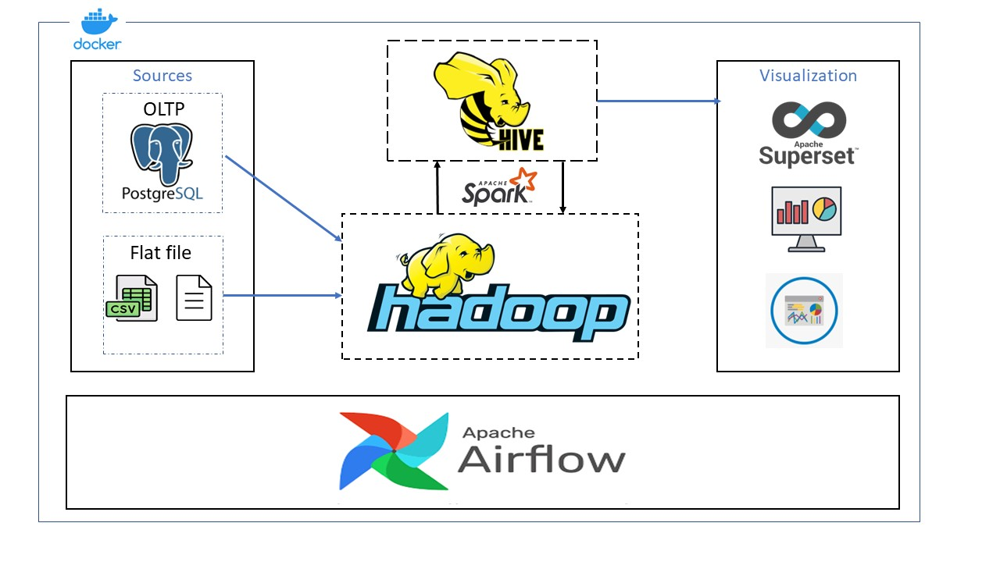
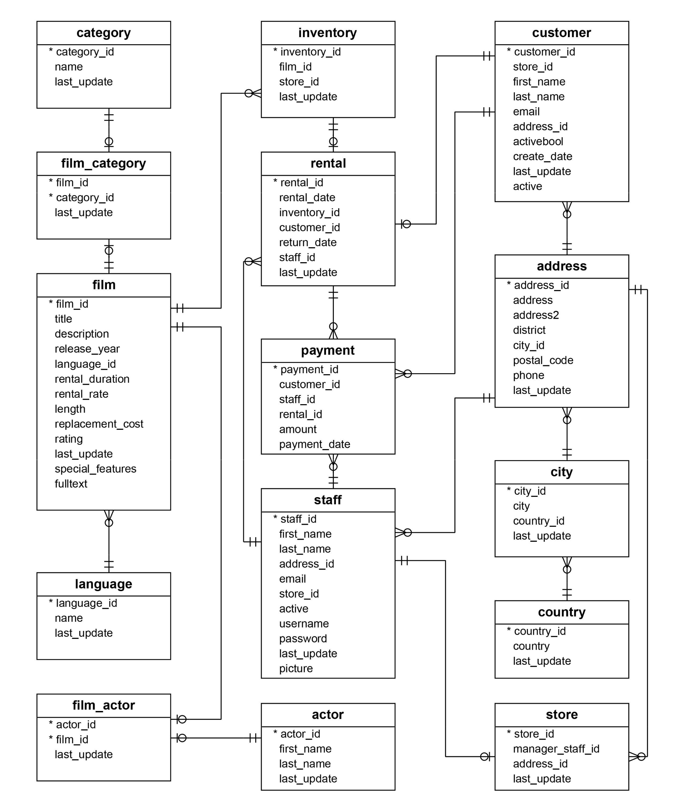
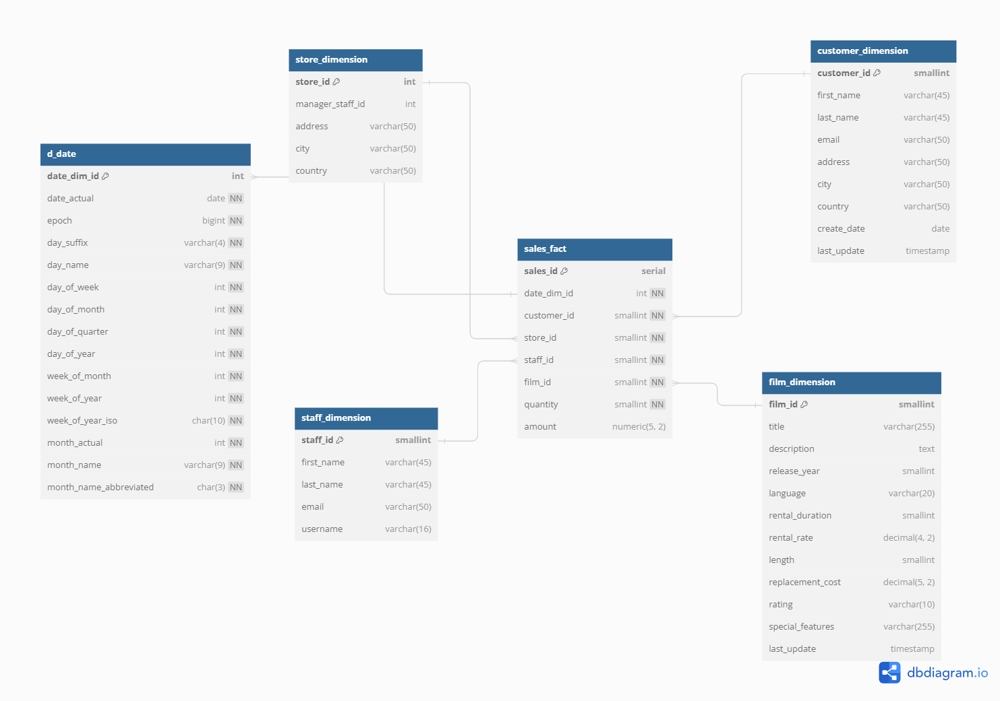
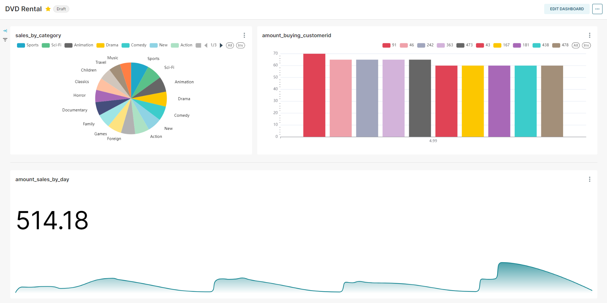
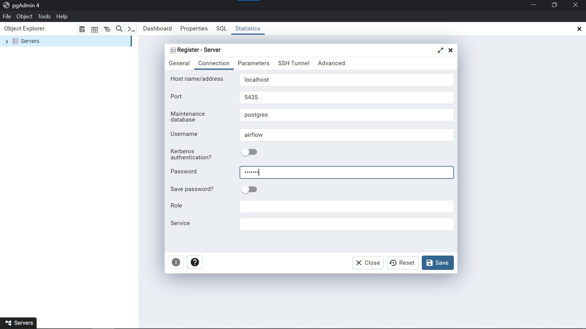

[](https://gitter.im/big-data-europe/Lobby)

# Data Pipeline and Analytics Stack with Docker multi-container environment

This project demonstrates the design and implementation of a  data pipeline and analytics stack for processing, storing, and visualizing data. 

### Table of contents

* [Architecture diagram](#architecture-diagram)
* [Overview](#overview)
* [How it works](#how-it-works)
* [Prerequisites](#prerequisites)
* [Quick Start](#quick-start)
    * [PgAdmin4](#pgadmin4)
    * [HDFS](#hdfs)
    * [Spark](#spark)
    * [Hive](#hive)
    * [Superset](#superset)
* [Configure Environment Variables](#configure-environment-variables)
* [References](#references)
* [Demo](#demo)
* [Contact](#contact)

## Architecture diagram



## Overview
  ### Database Schema
  
  ### Dimensional Modeling with Sales
   
  ### Building report
   

## How it works
* Data Sources:

    OLTP PostgreSQL Database: The primary source of transactional data.

    Flat Files: Additional data sources in various formats.
* Data Ingestion:

    Apache Hadoop HDFS: Serves as the data lake for ingesting raw data.

* Data Transformation:

    Apache Hive: The data warehouse for structured data storage and transformation.

    Apache Spark: Powers ETL (Extract, Transform, Load) processes for data processing.
* Data Modeling:

    Hive QL: Used for defining and applying data models on top of the structured data.
* Data Visualization:

    Apache Superset: Provides a rich and interactive interface for data exploration and visualization.
* Orchestration and Workflow:

    Apache Airflow: Manages and schedules data pipeline workflows.
* Docker: 

    Containerizes and isolates components for easy deployment and scalability.


## Quick Start

To deploy an the cluster, run:
```
  docker-compose up
```

`docker-compose` creates a docker network that can be found by running `docker network list`.

Run `docker network inspect` on the network to find the IP the hadoop interfaces are published on. Access these interfaces with the following URLs:

There's up to 19 containers, so it can consume about 6GB RAM or more, that much containers requiring a lot of configuration and reading documents. This project is developing based on Marcel Jan's [project](https://github.com/DucAnhNTT/docker-hadoop-spark)

The stack includes the following components and technologies:

* Namenode: http://<dockerhadoop_IP_address>:9870/dfshealth.html#tab-overview
* History server: http://<dockerhadoop_IP_address>:8188/applicationhistory
* Datanode: http://<dockerhadoop_IP_address>:9864/
* Nodemanager: http://<dockerhadoop_IP_address>:8042/node
* Resource manager: http://<dockerhadoop_IP_address>:8088/
* Spark master: http://<dockerhadoop_IP_address>:8080/
* Spark worker: http://<dockerhadoop_IP_address>:8081/
* Hive: http://<dockerhadoop_IP_address>:10001
* Airflow Webserver: http://<dockerhadoop_IP_address>:8082
* Superset: http://<dockerhadoop_IP_address>:8088
* Postgres (also metastore for Airflow): http://<dockerhadoop_IP_address>:5435
  
## Prerequisites
What you need to run the project:
- [Docker](https://www.docker.com/) - I suggest using Docker 4.22.x or above.
- [Apache Component](https://www.apache.org/) - This project is kind of based on Apache component like HDFS, Hive, Spark,... so I would highly recommend you to take a look each component's docs.
- [OLAP Dimemsional Modeling](https://www.youtube.com/watch?v=lWPiSZf7-uQ) - In this project I try to understand a completely data pipeline from source to visualize, and Modeling DataWwarehouse too, and there a video that cover a lot of things about DW and you can try [it](https://www.youtube.com/watch?v=lWPiSZf7-uQ).
- [PgAdmin4](https://www.pgadmin.org/download/) - This is the most popular and feature rich Open Source administration and development platform for PostgreSQL, we use that to create our OLTP database for ease of using.
- [Airflow Orchestration](https://airflow.apache.org/docs/apache-airflow/stable/howto/docker-compose/index.html) - I haven't done with Airflow services yet, because my laptop can't handle that much containers, but don't worry I will update ASAP.
## Quick Start 
  ### PgAdmin4: 
  Install and ensure that Postgres container also running, then you can connect to that Postgres using PgAdmin4 interface.



  Then you need to create a database, restore that database with the option Restore from File, and choose this directory "./dataForProject/dvdrental". Now your own database to play with, and the schema is above.

  Continue, I need you to create the DW based on that database, There's lot of way to do that, but in this project and faster way you can create the DW Dimensional Model inside the database, and then we dump that data to HDFS.

  So, in the Postgres database, you can create the script and run that one I already give you in this path "./dataForProject/script-init/createDW-when-db-have-init.sql"


  ### HDFS
  Go to the bash shell on the namenode with that same Container ID of the namenode.
  ```
    docker exec -it namenode bash
  ```


  Create a HDFS directory /data/staging.

  ```
    hdfs dfs -mkdir -p /data/staging
  ```

  ### Spark

  Move on, go to your CMD and make sure your Spark cluster have the Postgres JDBC pre-installed and compatible with each other, I have researched and use it smoothly, all you need to do is copy the postgresql-42.6.0.jar to each Spark workers and Spark master. (TBH, you can run my script i give you in the text file and run it in your host CMD)

  Go to http://<dockerhadoop_IP_address>:8080 or http://localhost:8080/ on your Docker host (laptop) to see the status of the Spark master.

  Go to the command line of the Spark master and start spark-shell.
  ```
  docker exec -it spark-master bash
  
  spark/bin/spark-shell --master spark://spark-master:7077
  ```
  run the code I provide you in this directory "./dataForProject/script-init/read-postgres-to-hdfs.txt", copy and past to the terminal
  
  ### Hive

  Go to the command line of the Hive server and start hiveserver2

  ```
    docker exec -it hive-server bash

    hiveserver2
  ```

Maybe a little check that something is listening on port 10000 now
```
  netstat -anp | grep 10000
tcp        0      0 0.0.0.0:10000           0.0.0.0:*               LISTEN      446/java

```

Okay. Beeline is the command line interface with Hive. Let's connect to hiveserver2 now.

```
  beeline -u jdbc:hive2://localhost:10000 -n root
  
  !connect jdbc:hive2://127.0.0.1:10000 scott tiger
```

Didn't expect to encounter scott/tiger again after my Oracle days. But there you have it. Definitely not a good idea to keep that user on production.

Not a lot of databases here yet.
```
  show databases;
  
+----------------+
| database_name  |
+----------------+
| default        |
+----------------+
1 row selected (0.335 seconds)
```

Let's change that.

```
  create database dvdrentaldw;
  use dvdrentaldw;
```

And let's create a table.

Now the last thing, run the script "./dataForProject/script-init/hive-dw-init.txt", to create DW in Hive, ATTETION!: In Hive, primary keys and foreign keys are not natively supported, as it prioritizes large-scale data processing and querying over enforcing traditional relational constraints. Hive tables do not enforce primary key uniqueness or foreign key relationships. Data quality and consistency checks are typically handled upstream before data is loaded into Hive. For strict enforcement of these constraints, consider using traditional relational databases alongside Hive or data warehouse solutions.


## Configure Environment Variables

The configuration parameters can be specified in the hadoop.env file or as environmental variables for specific services (e.g. namenode, datanode etc.):
```
  CORE_CONF_fs_defaultFS=hdfs://namenode:9000
```

CORE_CONF corresponds to core-site.xml. fs_defaultFS=hdfs://namenode:9000 will be transformed into:
```
  <property><name>fs.defaultFS</name><value>hdfs://namenode:9000</value></property>
```
To define dash inside a configuration parameter, use triple underscore, such as YARN_CONF_yarn_log___aggregation___enable=true (yarn-site.xml):
```
  <property><name>yarn.log-aggregation-enable</name><value>true</value></property>
```

The available configurations are:
* /etc/hadoop/core-site.xml CORE_CONF
* /etc/hadoop/hdfs-site.xml HDFS_CONF
* /etc/hadoop/yarn-site.xml YARN_CONF
* /etc/hadoop/httpfs-site.xml HTTPFS_CONF
* /etc/hadoop/kms-site.xml KMS_CONF
* /etc/hadoop/mapred-site.xml  MAPRED_CONF

If you need to extend some other configuration file, refer to base/entrypoint.sh bash script.

## Demo


## Contact
Please feel free to contact me if you have any questions.
<a href="https://ducanh0285@gmail.com" target="blank"></a><a href="https://www.facebook.com/ducanh.pp" target="blank"></a><a href="https://twitter.com/Ducann02Nguyen" target="blank"></a><a href="https://www.linkedin.com/in/%C4%91%E1%BB%A9c-anh-nguy%E1%BB%85n-026404229/" target="blank"></a>